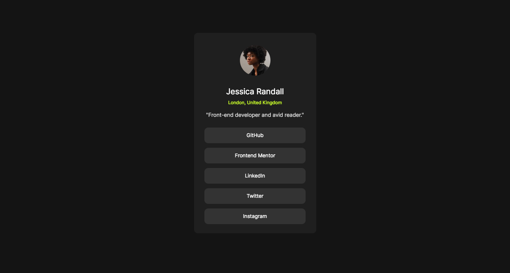

# Frontend Mentor - Social links profile solution

This is a solution to the [Social links profile challenge on Frontend Mentor](https://www.frontendmentor.io/challenges/social-links-profile-UG32l9m6dQ).

## Table of contents

- [Overview](#overview)
  - [The challenge](#the-challenge)
  - [Screenshot](#screenshot)
  - [Links](#links)
- [My process](#my-process)
  - [Built with](#built-with)
  - [What I learned](#what-i-learned)
  - [Continued development](#continued-development)
  - [Useful resources](#useful-resources)
- [Author](#author)
- [Acknowledgments](#acknowledgments)


### Screenshot



### Links

- Solution URL: [solution](https://www.frontendmentor.io/solutions/social-links-profile-KAnghNZviU)
- Live Site URL: [live site](https://mohamedballa.github.io/social-links-profile/)

## My process
I First build the structure using HTML5 markup
then added style with CSS (cutom proerties and Grid), with interactivity.
### Built with

- Semantic HTML5 markup
- CSS custom properties
- CSS Grid

### What I learned
Was very good reinforicing building HTMl structure , I still have problem with css style . Needed to review some code about how to center and control the size of elements.
I have started using grid to control the layout of the page like this :
```CSS
.card-btn{
    display: grid;
    gap: 0.75rem;
    place-content: center;
}
```

### Continued development
I need to work on layouts and CSS styling. this is the most important area I need to work in

### Useful resources
I can't say enough about kevin powel channel in youtube, it has the best lession in CSS , especially since he foucus on vanila CSS , and his teaching style is easy and to the point.
- [His channel ](https://www.youtube.com/@KevinPowell) - Highly recommend his series about Grid and Flexbox.


## Author

- Frontend Mentor - [@mohamedballa](https://www.frontendmentor.io/profile/mohamedballa)
- Twitter - you can follow me here:[@mhballa1](https://x.com/mhballa1)


